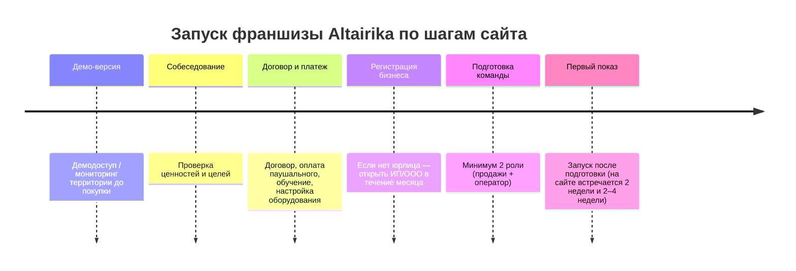

# Обновление базы знаний Altairika по франшизе и B2B на основе официального сайта

## Executive summary

Официальный сайт entity["company","Альтаирика","vr-edtech, russia"] описывает франшизу «Виртуальная Энциклопедия» как бизнес в сфере дополнительного образования с эксклюзивом на территорию и без обязательной аренды помещения (выездная модель). Ключевые цифры, которые прямо заявлены на странице франшизы: запуск первой франшизы в 2017 году, маржинальность 40%, средний срок окупаемости 12–18 месяцев, средний ежемесячный доход партнёров “от 300 тыс. ₽”, и “>5 000 000” зрителей в РФ. citeturn40view0

Условия по паушальному взносу на сайте изложены не как фиксированная «прайсовая» цифра: на странице для малых городов указано, что паушальный взнос “от 850 000₽” и рассчитывается индивидуально по территории; на калькуляторе приведён пример “765 000 ₽” и отдельно указан дисклеймер, что расчёт ориентировочный и выручка показана до вычета роялти/расходов. citeturn29view0turn16view0

Важная правка для вашей текущей KB: на сайте в качестве VR-оборудования фигурируют шлемы серий Quest и Pico (и отдельно — iPad 2022+ как планшет оператора/управления), а не «VR-шлемы на базе iPad». Также на сайте есть публичные цены на некоторых региональных страницах (например, Алтайский край), поэтому правило “никогда не называть цен” конфликтует с реальностью сайта и нуждается в более умном условном раскрытии (цитировать только то, что опубликовано для конкретного региона/тарифа). citeturn6view4turn30view0turn38view1

---

## Охват страниц и что именно было просмотрено

Ниже — все страницы и документы altairika.ru (включая поддомен docs), которые были реально просмотрены при подготовке этого обновления:

- `https://altairika.ru/franchise` — основная страница франшизы (описание, поддержка, аналитика, шаги запуска, FAQ). citeturn40view0turn6view4turn6view3  
- `https://altairika.ru/franchise/smalltown` — франшиза для малых городов (экономика, комплект, штат, паушальный “от 850 000₽”). citeturn30view0turn29view0  
- `https://altairika.ru/page122527266.html` — калькулятор франшизы (параметры, пример выручки, дисклеймеры). citeturn16view0  
- `https://altairika.ru/demo` — демо-пакет франшизы (2 недели, цена, состав). citeturn21view0  
- `https://altairika.ru/withdrawal` — правила вывода средств/комиссии/связь с роялти. citeturn12view0  
- `https://altairika.ru/franchise/schoolsoftware` — VR-классы для школ (B2B): комплект, офлайн-локальная сеть, 4 шага запуска урока, госзакупки 44‑ФЗ/223‑ФЗ. citeturn8view2turn9view2  
- `https://altairika.ru/franchise/vrcinema` — VR‑кинотеатр для бизнеса (B2B): старт, требуемое оборудование, тарифы и сроки (6–36 месяцев / “безлимит”). citeturn11view0turn11view1  
- `https://altairika.ru/details` — реквизиты АО (ОГРН/ИНН/юр. адрес/гендир). citeturn17view0  
- `https://altairika.ru/company/history` — история компании/франчайзинговой сети, показатели 2024–2025, B2G‑сегмент через реестр ПО. citeturn20view0  
- `https://altairika.ru/company/publications` — публикации/ссылки на рейтинги и материалы в СМИ (в т.ч. про франшизы). citeturn18view0  
- `https://altairika.ru/documents` — страница «Документация» со ссылками на подтверждающие документы. citeturn43view0  
- `https://docs.altairika.ru/Info_STVR.pdf` — функциональные характеристики ПО “SpaceTouch VR” (локальная сеть, синхронные показы, статистика, client-server). citeturn35view0turn36view2  
- `https://docs.altairika.ru/Izmenenie_to_AO.pdf` — изменение к свидетельству о госрегистрации программы для ЭВМ (переход права к АО). citeturn49view0  
- `https://docs.altairika.ru/Recomendation_2.jpeg` — диплом «Рекомендовано педагогическим сообществом» для продукта «Виртуальная энциклопедия». citeturn50view0  
- `https://altairika.ru/` — главная страница (как проходит сеанс, “учебный модуль до 30 минут”, базовый комплект, “до 60 зрителей”). citeturn37view0  
- Примеры страниц каталога для иллюстрации контента (возраст/длительность/языки):  
  - `https://altairika.ru/catalog/around_the_world` citeturn31view0  
  - `https://altairika.ru/catalog/putorana_plateau` citeturn32view0  
  - `https://altairika.ru/catalog/dino` citeturn32view2  
  - `https://altairika.ru/catalog/aripi` citeturn32view3  
- Пример региональной страницы с публичными ценами и юр. раскрытием партнёра: `https://altairika.ru/altay` citeturn38view1  
- Блог-статья о скорости запуска: `https://altairika.ru/tpost/3i1lublmy1-kak-bistro-ya-smogu-zapustitsya-po-frans` citeturn42view0  

---

## База знаний для системного промпта бота

Ниже — **чистый текст KB**, подготовленный так, чтобы его можно было вставить в системный промпт Telegram‑бота. Внутри нет ссылок и цитат; все источники — в разделе “Карта источников”. citeturn40view0turn29view0turn35view0turn17view0  

```text
# Altairika — франшиза и B2B-продукты (только по данным altairika.ru)

## Позиционирование
Altairika (“Виртуальная Энциклопедия”) — VR‑проект с социальной миссией: уроки/сеансы в формате виртуальной реальности для детей (на сайте встречается 4+; на странице франшизы указана основная аудитория 6–14).
Контент: образовательные и развлекательные 360°/180° VR‑фильмы, синхронный показ нескольким зрителям одновременно (до 60).

## Франшиза “Виртуальная Энциклопедия”
### Суть модели
Партнёр получает право работать под брендом в закреплённом регионе (эксклюзив на территорию; без конкуренции внутри сети). Модель не требует обязательной аренды помещения для старта (выездной формат).

### Где проводить сеансы (типовые площадки)
Школы и детские сады (государственные и частные), детские лагеря, развивающие центры, детские мероприятия, музеи/библиотеки/дома культуры и другие учреждения образования/культуры/досуга.

### Экономика и сроки (как указано на сайте)
- Маржинальность: 40% (общая цифра на странице франшизы).
- Окупаемость: 12–18 месяцев (и на франшизе, и в калькуляторе/странице для малых городов).
- Доход: средний ежемесячный доход партнёров “от 300 тыс. ₽” (общая страница франшизы).
- Для малых городов до 250 тыс. жителей: минимальный доход “150 т. р. в месяц”; минимальные инвестиции “1,5–3 млн. р.” (отдельная посадочная страница).
- Публичный калькулятор: примерная годовая выручка/месяц (до вычета роялти и операционных расходов), примерная сумма паушального взноса и дисклеймер, что расчёт ориентировочный.

### Паушальный взнос и платежи
- Паушальный взнос: “от 850 000₽”, рассчитывается индивидуально для каждой территории (страница для малых городов).
- На общей странице франшизы: “средний размер паушального взноса 900 тыс. ₽”.
- В калькуляторе: показывается примерная сумма паушального взноса и рекомендация уточнить у менеджера.
- Роялти: размер/формула роялти НЕ указаны на публичных страницах сайта.
  - На сайте есть отдельная страница “Запрос на вывод средств”, где роялти упоминается в правилах (минимальный роялти за следующий месяц при определённых условиях).

### Запуск франшизы: шаги
Официально на сайте встречаются такие элементы процесса:
1) Демо-версия/демодоступ (рекомендуется до покупки, чтобы оценить продукт и территорию).
2) Собеседование (проверка ценностей/целей).
3) Заключение договора + оплата паушального взноса + обучение + настройка оборудования.
4) Оформление ИП/ООО (если не юрлицо — открыть ИП/ООО в течение месяца).

Отдельно в блоге компании указано, что запуск возможен “за 2 недели” (как утверждение компании), а на странице франшизы также есть диапазон “2–4 недели в среднем нужно для старта”.

### Команда партнёра (минимум)
На странице для малых городов: минимум 2 роли — менеджер по продажам (назначает сеансы в школах) и оператор (проводит сеансы). Партнёр может совмещать одну из ролей.

### Оборудование и техтребования (франшиза)
- VR‑шлемы: Quest и Pico (на разных страницах также упоминаются Oculus Quest 2/3/3s и Pico4).
- Количество шлемов:
  - синхронный показ до 60 устройств;
  - на странице для малых городов: “не менее 11 шт., стандартно — 30”;
  - в калькуляторе встречаются рекомендации по количеству шлемов (на странице есть противоречивые значения).
- Планшет оператора: Apple iPad 2022+ с памятью не менее 128GB и поддержкой Wi‑Fi + Cellular.
- Wi‑Fi роутер (на странице франшизы и VR‑классов указан Keenetic Viva KN‑1913).
- Акустика: колонки 40–90 Вт (часто), а на некоторых страницах — “от 90 Вт с Bluetooth”.
- Power‑bank: от 10 000 мА·ч на каждый VR‑шлем (на части страниц указано как опционально).

### Как работает ПО и показ (важно для объяснений)
- Показ — синхронная сессия воспроизведения VR‑контента на VR‑устройствах.
- Управление показом производится с iPad оператора.
- Локальная сеть: роутер создаёт локальную сеть для устройств; постоянный доступ к интернету не требуется для стабильной работы показа.
- ПО и контент: на сайте указано, что ПО отечественное и включено в реестр ПО Минцифры РФ; контент — большая библиотека VR‑фильмов.
- По документации SpaceTouch VR: контент загружается на iPad оператора с сервера, затем передаётся на VR‑устройства через локальную сеть; сохраняется статистика показов (в т.ч. длительность, состав сессии, контент, GPS‑локация), затем статистика отправляется на сервер.

### Поддержка и “что входит”
На странице франшизы и/или малых городов перечисляется:
- Техподдержка 7 дней в неделю; помощь с настройкой оборудования.
- Сопровождение / отдел развития; консультации юриста и бухгалтера (на общей странице франшизы).
- Помощь в найме: регламенты, шаблоны; доступ к корпоративному аккаунту на hh.ru (на общей странице франшизы).
- Сообщество партнёров: закрытые чаты (для собственников; для менеджеров и операторов); “нет конкуренции внутри”.
- Обучение: академия/база знаний, онлайн‑курсы, офлайн‑встречи; встречи с экспертами.
- Методические материалы: сценарии уроков, методички, VR‑квизы.
- Продвижение: брендбук; шаблоны для соцсетей; материалы и мерч; “рабочая страница/сайт” с возможностью онлайн‑оплаты; в FAQ указана также “группа ВКонтакте”.

### Аналитика и инструменты управления
На странице франшизы указаны:
- Система мониторинга (показы, локации, расписание в реальном времени).
- CRM Битрикс24 (анализ прибыли и конверсии).
- Показатели эффективности (работа с отделом развития).

### Важно про рекламу
В FAQ на странице франшизы сказано: интернет‑реклама не обязательна; можно стартовать без допзатрат на рекламу.

### Вывод средств и комиссии (если пользователь — партнёр)
На сайте есть публичная страница “Запрос на вывод средств” с условиями:
- Минимальная сумма вывода — более 50 000 руб.
- Комиссия агента: 2,5% при взаимозачёте за роялти; 4% при выводе на расчётный счёт.
- Если заявка на вывод подаётся после 15 числа — должен быть оплачен минимальный роялти за следующий месяц.
- Срок вывода на р/с ИП — в течение 5 рабочих дней с момента подачи заявки.
Подробности “о выводе средств” вынесены в академию (страница требует авторизацию).

## Сопутствующие B2B-продукты (не франшиза)
### “VR‑классы для школ” (ПО•оборудование•контент)
- Подходит для госзакупок по 44‑ФЗ и 223‑ФЗ; российское ПО; на странице указана “бессрочная лицензия”.
- Можно приобрести ПО и контент отдельно, если у клиента уже есть VR‑очки.
- Как проходит урок: учитель выбирает фильм на планшете → дети надевают шлемы → класс смотрит синхронно → VR‑викторина закрепляет знания.
- Комплект: VR‑очки Quest/Pico; планшет 2022+ (128GB, Wi‑Fi+Cellular) + акустика 40–90 Вт; роутер Keenetic Viva KN‑1913 (локальная сеть без прямого доступа к интернету); power‑bank от 10 000 мА·ч на очки.
- 4 шага до первого VR‑урока: подготовить планшет (ПО+контент) → подключить роутер и акустику → настроить очки (синхронный показ на 60 устройств) → запустить сеанс (в классе или актовом зале).
- Указано наличие демо для государственных учреждений (в т.ч. доступ к приложению и 5 фильмам на выбор).

### “VR‑кинотеатр для бизнеса”
- Позиционируется как отечественное ПО для госзакупок 44‑ФЗ/223‑ФЗ.
- Библиотека: “более 150 фильмов”, “контент на 22 языках”, автономность (интернет не требуется).
- Что нужно для старта: заявка → финмодель от менеджера → договор/демодоступ → “лицензионный платёж” → подготовка оператора → проверка оборудования.
- Оборудование (на странице): Oculus Quest 2/3/3s, Pico4; максимум 60 шлемов для синхронного показа; iPad 2022+ (128GB, Wi‑Fi+Cellular); акустика от 90 Вт с Bluetooth; роутер; power‑banks 10 000 мА·ч (опционально).
- Тарифы (цены не указаны):
  - “Стандарт”: все фильмы из библиотеки на срок от 6 до 36 месяцев; включает ПО, обучение, техподдержку 7/7, методику, маркетинг, каталог эксклюзивов, продление; “от 500 показов в месяц”.
  - “Безлимит”: неограниченный по времени доступ к определённому количеству фильмов; включает то же + возможность расширять контент; неограниченное число показов в месяц.

## Контакты и реквизиты (публичные)
- АО “Альтаирика”: ОГРН, ИНН, КПП и юр. адрес указаны на странице “Реквизиты компании”.
- Генеральный директор: указан на странице реквизитов.
- Всероссийский номер и e-mail указаны в футере страниц.
- На региональных страницах могут быть отдельные контакты и юр. раскрытие партнёра как эксклюзивного представителя по территории.

## Правила для ассистента (важно)
- Не выдумывать: роялти (размер/формула), точные цены франшизы, цены B2B‑тарифов, “гарантии окупаемости”.
- Про цены: если пользователь спрашивает цену, сначала уточнить город/регион. Называть цену ТОЛЬКО если она явно опубликована на официальной странице для этого региона/продукта; иначе — направлять к менеджеру за расчётом.
- Если факт не указан на сайте — отвечать “не указано на сайте” и предлагать связаться с менеджером/оставить заявку.
```

### Mermaid‑таймлайн запуска франшизы (для внутреннего использования)



Источники шагов и сроков: страница франшизы, страница для малых городов и блог-статья о запуске. citeturn6view3turn29view0turn42view0  

---

## Change log для вашего исходного документа

Ниже — что именно в вашем текущем KB‑документе **нужно заменить**, если вы хотите, чтобы он соответствовал публичным данным сайта. Формат: **Replace → With** (точные вставки).

### Франшиза: паушальный, экономика, сроки

**Replace (у вас):**  
«Паушальный взнос: от 950 000 ₽… Итого вход: от 2 000 000 ₽… Роялти: 62 ₽ с одного зрителя…»

**With (по сайту):**  
«Паушальный взнос: **от 850 000₽**, рассчитывается индивидуально для каждой территории (для малых городов до 250 тыс.). На странице франшизы также указано: **средний размер паушального взноса — 900 тыс. ₽**. Размер/формула роялти публично **не указаны на сайте** (но роялти упоминается в правилах вывода средств и в дисклеймере калькулятора как вычет из выручки).» citeturn29view0turn7view0turn12view0turn16view0  

**Replace (у вас):**  
«Средний оборот: 500 000–700 000 ₽/мес… Окупаемость: от 12 месяцев… Запуск до первого сеанса: 2 недели.»

**With (по сайту):**  
«Экономика (как заявлено на сайте): маржинальность **40%**, средний срок окупаемости **12–18 месяцев**. Средний ежемесячный доход партнёров в РФ — **от 300 тыс. ₽**. Для малых городов до 250 тыс.: минимальный доход — **150 т. р./мес**, минимальные инвестиции — **1,5–3 млн. р.** Сроки запуска: в блоге указано “**за 2 недели**”, на странице франшизы — “**2–4 недели в среднем нужно для старта**”.» citeturn40view0turn30view0turn7view0turn42view0  

### Оборудование и формулировка “как это работает”

**Replace (у вас):**  
«VR‑шлемы на базе Apple iPad 2022+, 128 ГБ… Работает через локальную сеть, без интернета.»

**With (по сайту):**  
«VR‑оборудование: **VR‑шлемы серий Quest и Pico** (на страницах также: Oculus Quest 2/3/3s и Pico4). Управление показом — с **Apple iPad 2022+ (не менее 128GB, Wi‑Fi + Cellular)**. Роутер (на сайте указан Keenetic Viva KN‑1913) создаёт **локальную сеть**, постоянный доступ к интернету для стабильного показа **не требуется**. Power‑bank от 10 000 мА·ч на каждый шлем; акустика 40–90 Вт (иногда указывается “от 90 Вт с Bluetooth”).» citeturn6view4turn8view2turn29view0turn9view2  

### “Что входит” и инструменты

**Replace (у вас):**  
«Аналитика по сеансам… Обучение команды и поддержка…»

**With (по сайту, расширение):**  
«На сайте явно перечислены инструменты: **система мониторинга показов/локаций/расписания**, **CRM Битрикс24** (анализ прибыли и конверсии), работа по KPI с отделом развития. Также заявлены: техподдержка 7/7, сопровождение, консультации юриста и бухгалтера, помощь в найме (в т.ч. корпоративный аккаунт на hh.ru), закрытые чаты для собственников и для менеджеров/операторов, методические материалы и VR‑квизы, брендбук и шаблоны для соцсетей, “рабочая страница/сайт” с онлайн‑оплатой и группа ВК.» citeturn6view1turn6view0turn6view4  

### Контакты и юридические данные

**Replace (у вас):**  
«Головной офис… Адрес офиса: Москва, Мясницкая 13, стр. 18»

**With (по сайту):**  
«Юр. данные и руководитель указываются на странице реквизитов АО. Юр. адрес: 121205, г. Москва, тер. инновационного центра Сколково, Большой б‑р, д. 42 стр. 1. Всероссийский номер: +7 800 555‑50‑14. Генеральный директор: **Урванцев Константин Юрьевич**.» citeturn17view0  

### Правило “не называй цены”

**Replace (у вас):**  
«Конкретные цифры — только через менеджера. Не называй цены самостоятельно.»

**With (по сайту, корректное правило):**  
«Цены можно называть **только если** пользователь спрашивает про конкретный регион/продукт, и на официальной странице altairika.ru для этого региона/продукта цена **прямо опубликована** (пример: региональная страница Алтайского края содержит конкретные цены и длительности). В остальных случаях — говорить, что стоимость зависит от условий и просить оставить заявку/контакт менеджеру.» citeturn38view1  

---

## Карта источников: URL → раздел страницы → какие факты извлечены

| URL (как на сайте) | Раздел/фрагмент | Извлечённые факты (в сжатом виде) | Подтверждение |
|---|---|---|---|
| `https://altairika.ru/franchise` | Блок “о франшизе”, “вдохновляем…”, “что входит”, “Условия запуска”, FAQ | 2017 запуск франшизы; >5 млн зрителей РФ; маржинальность 40%; окупаемость 12–18; доход от 300 тыс.; эксклюзив на территорию; ПО в реестре; аналитика/CRM/мониторинг; состав “паушального” (ПО/контент/поддержка/эксклюзив/сайт/брендбук/hh.ru); требования к оборудованию; аудитория 6–14; доп.продукты | citeturn40view0turn6view4turn6view1turn7view0 |
| `https://altairika.ru/franchise/smalltown` | Экономика + “что входит” + “что нужно для старта” | Малые города ≤250 тыс.: рентабельность 40% (через месяц); инвестиции 1,5–3 млн; доход 150 т.р./мес; паушальный от 850k; штат минимум 2 роли; контент 29 языков; оборудование (≥11, стандарт 30, максимум 60 синхронно) | citeturn30view0turn29view0 |
| `https://altairika.ru/page122527266.html` | Калькулятор | Диапазон населения 100–250 тыс; пример: 150k → ~22 школы; средняя цена билета 420; рекомендации по шлемам; минимум 2 сеанса/день; пример паушального 765k; выручка/год 2,94M; дисклеймер “до вычета роялти и расходов” | citeturn16view0 |
| `https://altairika.ru/demo` | Демо-пакет | 2 недели; цена 10 000 ₽; работает на Oculus Go и Quest 2/3/3s; что входит: академия/инструкции, консультации, приложение, AR‑афиши, 3 фильма | citeturn21view0 |
| `https://altairika.ru/withdrawal` | “Основное положение” | Минимум вывода >50k; комиссия 2,5% взаимозачёт за роялти, 4% вывод на р/с; если после 15 числа — оплатить минимальный роялти следующего месяца; срок 5 рабочих дней | citeturn12view0 |
| `https://altairika.ru/franchise/schoolsoftware` | Комплект + “4 шага до первого VR‑урока” | Госзакупки 44/223; ПО + контент можно отдельно; комплект: Quest/Pico, планшет 2022+ 128GB Wi‑Fi+Cellular, акустика 40–90Вт, Keenetic Viva KN‑1913, power‑banks; локальная сеть без прямого доступа к интернету; синхрон до 60 устройств; сценарий урока + VR‑квиз | citeturn8view2turn9view2turn8view0 |
| `https://altairika.ru/franchise/vrcinema` | “Что нужно для старта” + “тарифы” | Госзакупки 44/223; библиотека 150+, 22 языка; автономность без интернета; оборудование (Quest/Pico, iPad 2022+, акустика 90Вт, power‑bank опц.); тарифы Стандарт (6–36 мес, от 500 показов/мес) и Безлимит | citeturn11view0turn11view1 |
| `https://altairika.ru/details` | Реквизиты компании | АО: ОГРН/ИНН/КПП и др.; юр. адрес (Сколково, Большой б-р 42 стр.1); гендир Урванцев К.Ю.; федеральный номер | citeturn17view0 |
| `https://altairika.ru/company/history` | 2024–2025 блоки | 2025: “теперь мы АО”; пополнение библиотеки; 1 306 301 ребёнок посетил уроки; статус МТК, резидент Сколково и др. 2024: стабильность ПО 99,74%; два продукта в реестре, выход в B2G; рост франчайзи | citeturn20view0 |
| `https://altairika.ru/company/publications` | Список публикаций | На сайте собраны ссылки на публикации о компании и франшизе, включая материалы/рейтинги entity["organization","Forbes","magazine"] | citeturn18view0 |
| `https://altairika.ru/documents` | Документация | На одной странице собраны ссылки на документы/подтверждения (реестр, рекомендации, руководство и т.д.) | citeturn43view0 |
| `https://docs.altairika.ru/Info_STVR.pdf` | Назначение/функции/архитектура/словарь | “SpaceTouch VR”: синхронные показы, локальная сеть, загрузка контента iPad→VR‑шлемы, статистика и GPS‑локации, client‑server, доступ партнёрам как часть пакета | citeturn35view0turn36view2 |
| `https://docs.altairika.ru/Izmenenie_to_AO.pdf` | Скан “Изменение…” | Госрегистр. отчуждения исключительного права: от ООО “Альтаир Диджитал” к АО “Альтаирика”; номер 2023665504; дата 28.08.2025 | citeturn49view0 |
| `https://docs.altairika.ru/Recomendation_2.jpeg` | Диплом | “Рекомендовано педагогическим сообществом” (знак/конкурс) для продукта “Виртуальная энциклопедия” | citeturn50view0 |
| `https://altairika.ru/` | “Как проходит сеанс”, блок для учителей | Сценарий сеанса (подготовка→инструктаж→просмотр→квиз/обсуждение); “учебный модуль до 30 минут”; “до 60 зрителей”; комплект (очки+планшет+роутер+аудио) | citeturn37view0 |
| `https://altairika.ru/altay` | Тарифы/оплата/юридическое раскрытие партнёра | Публичные цены (500/550/10 000/20 000 ₽) и длительности (до 30/45/60 мин) + раскрытие о “эксклюзивном представителе” по региону на основании лицензионных договоров | citeturn38view1 |

---

## Противоречия на сайте и рекомендации

### Зафиксированные расхождения (что именно “не сходится”)

Сайт содержит несколько разных значений для одних и тех же сущностей; для KB это критично, потому что LLM иначе будет отвечать “рандомными” цифрами.

- **Количество фильмов в библиотеке**: на главной — “136 фильмов”; на странице франшизы и B2B — “150+”; на региональной странице Алтая — “160+”. citeturn37view0turn11view0turn26view2  
- **Количество языков**: встречается “22 языка” (страница VR‑кинотеатра), но также “29 языков” (малые города). citeturn11view0turn29view0  
- **География по странам**: встречается “10 стран” (страница франшизы), но “12 стран” в истории/других блоках. citeturn40view0turn20view0  
- **Срок/скорость запуска**: “2 недели” (статья), но “2–4 недели” (страница франшизы). citeturn42view0turn7view0  
- **Поведенческое правило по ценам**: часть страниц призывает “уточнить у менеджера”, но региональные лендинги публикуют конкретные цены и дают оплату онлайн. citeturn38view1  
- **Калькулятор по VR‑шлемам**: в одном и том же HTML одновременно фигурируют разные подсказки/значения по рекомендуемому количеству шлемов, что создаёт риск “галлюцинаций” у ассистента. citeturn16view0  

### Рекомендации по “лечению” противоречий на сайте

1) **Выбрать одну “мастер‑цифру” на каждый показатель** (фильмы, языки, страны, партнёры) и привести к ней все лендинги + футеры. Практически: сделать один справочный блок (например, `/about/facts`) и подставлять его везде, чтобы цифры обновлялись централизованно. citeturn40view0turn37view0turn26view2  

2) **Калькулятор**: исправить ситуацию, где одновременно видны разные подсказки (“12 шлемов” и “30 шт.”). Это выглядит как баг шаблона/скрипта и ухудшает доверие. Пока не исправлено — в KB лучше закрепить правило: “по умолчанию ориентироваться на страницу smalltown (≥11, стандарт 30, максимум 60)”. citeturn16view0turn29view0  

3) **Роялти**: на публичных страницах нет формулы/размера роялти, но оно упоминается в калькуляторе и в процедурах вывода средств. Если компания хочет меньше вопросов к менеджерам — логично добавить хотя бы базовое описание (что считается базой, периодичность, минимумы). citeturn12view0turn16view0  

### Рекомендации для вашего KB и правил раскрытия цены

Ваше исходное правило “цены озвучивает только менеджер” больше не может быть абсолютным, потому что сайт публикует цены в отдельных регионах/для отдельных форматов (пример — Алтайский край). Самое безопасное правило для LLM‑ассистента:

- **Если цена/длительность/условие опубликованы на официальной странице для конкретного региона или продукта** — ассистент может цитировать **строго эту цифру** (без “скидок”, без “примерно”, без расширения на другие регионы). citeturn38view1  
- **Если цена не опубликована** — говорить, что стоимость уточняется индивидуально, и переводить в заявку/контакт менеджера.  
- **Никогда не вычислять “цену по аналогии”** (например, по калькулятору выручки или по другим регионам). Это особенно важно из‑за расхождений между страницами. citeturn16view0turn37view0